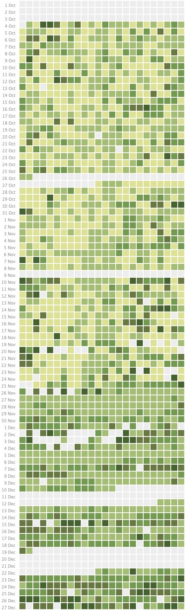

My local hospital in southern California publishes emergency room wait time estimates on its website. Unfortunately, only instantaneous data is available. I thought it would be neat to analyze some historical data, so I wrote a script to download it. Here are the results for the first 90 days (Oct - Dec 2020).
<!--more-->

There are 24 columns, binned by hour in Pacific Standard Time. For example, the leftmost column corresponds to midnight to 1am and the middle column corresponds to noon to 1pm.

The lighter the color, the shorter the wait. The lightest squares correspond to wait times under an hour. The darkest squares correspond to wait times over four hours.

The collection script was run on my personal computer, so the data is somewhat spotty due to internet outages, power outages, and moving. Nevertheless, there are some noteworthy trends. For instance, wait times clearly increased shortly after Thanksgiving and have remained persistently high. Since Christmas, wait times have increased even further — there is no time of day when wait times are under two hours.

As for when is the best time to go to the ER? Obviously never, but if you have to go, shoot for 8-9am. Then again, if you’re able to delay your visit, perhaps it’s not an emergency.

Stay healthy my friends.
